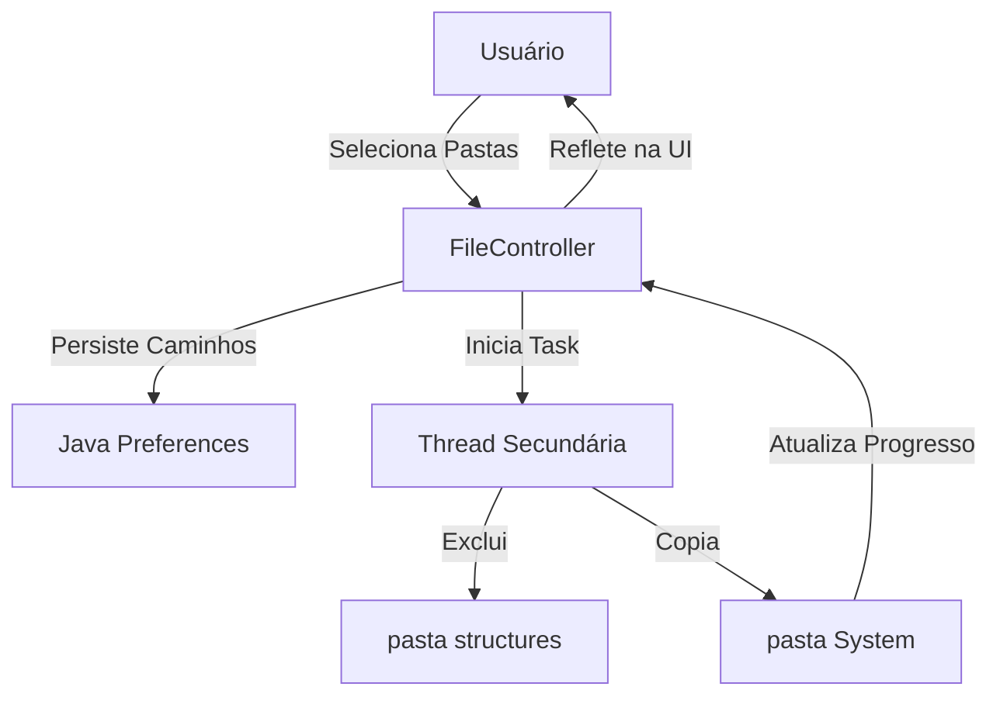

<div align="center">

# 🔄 Promob Version Manager

### Gerencie e alterne entre diferentes versões do Promob de forma instantânea e automatizada

[](https://www.oracle.com/java/)
[](https://openjfx.io/)
[](https://github.com/mkpaz/atlantafx)
[](https://maven.apache.org/)

</div>

---

## 📸 Preview

<div align="center">
  
</div>

---

## 📌 Sobre o Projeto

O **Promob Version Manager** é uma ferramenta utilitária desenvolvida para facilitar a rotina de profissionais que utilizam o ecossistema Promob e precisam alternar rapidamente entre diferentes builds e versões do sistema. A aplicação automatiza o processo de substituição de arquivos, garantindo que o ambiente esteja pronto para uso em segundos.

Construído com foco em **produção e produtividade**, o projeto incorpora:

- ✅ **Interface "Premium"** com AtlantaFX, fugindo do visual padrão Java Desktop
- ✅ **Operações IO Assíncronas** para manter a interface responsiva durante cópias pesadas
- ✅ **Persistência Inteligente** de caminhos locais via Java Preferences
- ✅ **Limpeza Automática** de diretórios de cache (`structures`) para evitar conflitos
- ✅ **Segurança Local** operando 100% offline e sem dependências externas críticas

---

## 🏛️ Arquitetura

A aplicação segue o padrão **MVC (Model-View-Controller)**, garantindo a separação clara entre a lógica de interface (JavaFX/FXML) e o motor de manipulação de arquivos.



### Componentes Principais
- **Frontend**: JavaFX + AtlantaFX (CSS Moderno)
- **Engine**: API `java.nio.file` para recursividade de alta performance
- **Threading**: `javafx.concurrent.Task` para gestão de background workers

---

## ✨ Funcionalidades

- [x] **Seleção de Origem/Destino:** Interface intuitiva para mapeamento de diretórios.
- [x] **Listagem em Tempo Real:** Detecção automática de subpastas de versão.
- [x] **Limpeza Inteligente:** Remoção da pasta `structures` antes da atualização.
- [x] **Substituição Recursiva:** Cópia completa da pasta `System` de forma otimizada.
- [x] **Dark/Light Mode:** Suporte completo a temas dinâmicos.
- [x] **Feedback Visual:** Barra de progresso e indicadores de status.

---

## 🖥️ Interface e Uso

A interação é simples e direta, focada no fluxo de trabalho do usuário:

1. **Configuração**: Selecione a pasta raiz das versões e a pasta de instalação do Promob.
2. **Seleção**: Escolha a versão desejada na lista suspensa (dropdown).
3. **Execução**: Clique em **"Trocar Versão"** e aguarde a conclusão automática.

> [!TIP]
> Os caminhos selecionados são salvos automaticamente e estarão preenchidos na próxima inicialização!

---

## 🚀 Como rodar localmente

### Pré-requisitos
- **JDK 11** ou superior
- **Maven 3.6+**

### Passos para Execução
```bash
# 1. Clone o repositório
git clone https://github.com/betolara1/Promob-Version-Manager-.git

# 2. Acesse o diretório do projeto
cd TrocarVersaoPromob/change-version

# 3. Execute via Maven
mvn clean javafx:run
```

---

## 🔒 Segurança e Configurações

- **Offline por Design:** Nenhuma requisição externa é feita, protegendo seus dados e segredos industriais.
- **Permissões:** Requer acesso de leitura/escrita nos diretórios selecionados.
- **Armazenamento:** Configurações salvas no Registro do Windows (via `java.util.prefs`), sem necessidade de arquivos `.env` ou bancos de dados locais.

---

## 📂 Estrutura do Projeto

```text
change-version/
 ├── src/
 │   ├── main/
 │   │   ├── java/com/betolara1/
 │   │   │   ├── App.java           # Entry point e gestão de temas
 │   │   │   └── FileController.java # Lógica principal e IO
 │   │   └── resources/com/betolara1/
 │   │       ├── primary.fxml       # Layout da interface
 │   │       └── style.css          # Customizações visuais
 └── pom.xml                        # Dependências Maven
```

---

## 🎯 Próximos Passos

- [ ] Sistema de logs em arquivo para auditoria.
- [ ] Atalho rápido para "Abrir Pasta de Destino".
- [ ] Empacotamento Nativo (.exe) via `jpackage`.
- [ ] Backup automático da versão anterior.

---

## 🛠️ Stack Tecnológica

| Tecnologia | Versão | Finalidade |
|-----------|--------|------------|
| Java | 11 | Linguagem e Runtime |
| JavaFX | 13 | Framework de Interface Gráfica |
| AtlantaFX | 2.0.1 | CSS Moderno e Temas |
| Ikonli | — | Pacotes de Ícones |
| Maven | 3.6+ | Gerenciamento de Dependências |

---

## 👨‍💻 Autor

Desenvolvido por **Roberto Lara** — Backend & Desktop Developer

[](https://github.com/betolara1)
[](https://www.linkedin.com/in/roberto-lara-dev/)

---

<div align="center">

**Promob Version Manager** — Transformando fluxos manuais em automações elegantes.

</div>
